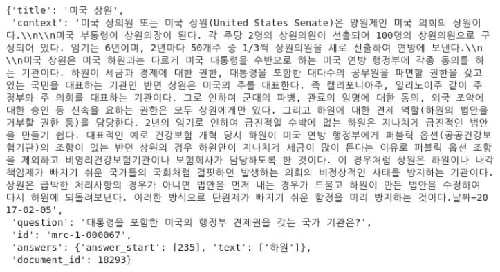

## Template 사용법

### 0. data_template

3. retrieval 코드 유의 사항
    - MorphsBm25Retrieval(config.bm25.morphs) 사용하지 말고SubwordBm25Retrieval(config.bm25.subword),
    TfIdfRetrieval(config.bm25.TfIdf) 사용
    - return_query_score=True 하면 각 토큰의 Tf-Idf 스코어 확인 가능한 리스트도 반환
    - roberta 베이스 모델은 mrc.yaml에 remove_columns: [token_type_ids] 필요
    - retrieval.yaml 파일 bm25의 model 종류 3가지 있는데 BM25Okapi 사용하면 될 듯


### 1. MRC 학습 방법
- `train_mrc.py`에서 mrc 모델을 학습해보실 수 있습니다.
- mrc 설정은 `config/retrieval.yaml`을 통해 수정할 수 있습니다.
    - 사용 가능한 `dataset_name`은 `default`, `klue_mrc`, `squad_kor_k1`이 있습니다.
    만약, 새로운 데이터셋을 추가하고 싶으시면, `utils/data_template.py`에서 해당 데이터셋을 표준 형식에 맞는 hf_dataset으로 반환해주는 함수를 구현해주시면 되겠습니다.
    - 사용 가능한 `metric`은 `squad`, `bleu`가 있습니다.

### 2. `TfIdfRetrieval` 사용법
- 구현채는 `module/retrieval.py`에 있으며, `TfIdfRetrieval` 클래스를 보시면 됩니다.
- `TfIdfRetrieval` 설정은 `config/retrieval`파일  `tfidf`에서 수정할 수 있습니다.
- `TfIdfRetrieval` 사용하기 위해서는 `fit()`, `create_embedding_vector()`를 실행해주셔야 합니다.
위 함수는 각각 `tfidf.model_file_name`과 `emb_file_name`파일이 `ifidf/` 폴더에 있다면 해당 파일을 불러옵니다. 만약 없다면 모델과 임베딩 행렬을 생성하고 이를 저장해줍니다.

### 3. inference 기능
- 학습한 MRC 모델과 Tfidf Retrieval 모델을 사용해 validation/test dataset의 예측값을 알고 싶다면, `inference.py`을 실행하면 됩니다.
- 해당 파일에는 **중요한 변수 4개**가 있습니다.
    1. `mode` validation dataset을 예측할건지 test dataset을 예측할건지 설정하는 변수입니다.
    이때, 예측하고자 하는 데이터셋 설정은 `mrc.data.dataset_name`에서 할 수 있습니다.
    그리고, `mode="test"`로 할 경우 오직 default test dataset만 예측할 수 있게 해두었습니다.
    2. `top_k`는 retrieval할 때 상위 몇 개의 context를 가져올지 설정하는 변수입니다.
    3. `only_mrc`는 오직 MRC 모델 성능만 평가할 수 있도록 하는 변수입니다.
    참고로, test dataset로 평가할 때는 `only_mrc`가 무시됩니다.
    4. `model_checkpoint`는 평가하고자 하는 MRC 모델의 checkpoint 경로를 의미하는 변수입니다.

## Template Structure

아래 구조에서 제외된 디렉토리 및 파일은 무시하셔도 무방합니다.
```
template
├── config/
|   ├── retrieval.py        # MRC 설정 파일
|   ├── mrc.py              # Retrieval 설정 파일
|	└── combine.py          # MRC + Retrieval 설정 파일
├── module/
|   ├── data.py             # data 클래스 (pl.LightningDataModule)
|   ├── encoder.py          # Retrieval 인코더 클래스
|   ├── retrieval.py        # Retrieval 모델 클래스
│   └── mrc.py              # MRC 모델 클래스
├── utils/
│   └── data_template.py    # 각 데이터셋 표준 hf_dataset 형식으로 반환해주는 함수 파일
├── inference.py            # validation/test dataset 추론 파일
├── train_mrc.py            # MRC 학습 파일
└── train_retrieval.py      # Retrieval 학습 파일
```

## Notes: standard format

### HF dataset format
```JSON
{
    "id": str,
    "title": str,
    "context": str,
    "question": str,
    "answers": {
        "text": List[str],
        "answer_start": List[int]
    }
}
```
### model output format
```JSON
# MRC
{
    "predictions": [{
        "id": str,
        "prediction_text": str
    }], //len=(# of data point)
    "label_ids": [{
        "id": str,
        "answers": {
            "text": List[str],
            "answer_start": List[int]
        }
    }] //len=(# of data point)
}

# Retrieval
{
    "sim_score": np.array, //shape=(# of data point, num_neg+1)
    "targets": np.array //shape=(# of data point)
}
```
