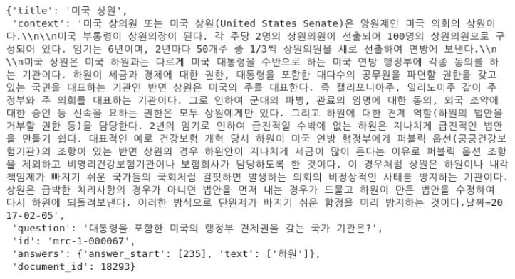

## template 사용법

### 1. MRC model 사용법

- `train_mrc.py`에서 mrc 모델을 학습해보실 수 있습니다.
- mrc 설정은 `config/retrieval.yaml`을 통해 수정할 수 있습니다.
  - 사용 가능한 `dataset_name`은 `default`, `klue_mrc`, `squad_kor_k1`이 있습니다.
    만약, 새로운 데이터셋을 추가하고 싶으시면, `utils/data_template.py`에서 해당 데이터셋을 표준 형식에 맞는 hf_dataset으로 반환해주는 함수를 구현해주시면 되겠습니다.
  - 사용 가능한 `metric`은 `squad`, `bleu`가 있습니다.

**mrc 코드 유의 사항**

- roberta 베이스 모델은 `mrc.yaml`에 `remove_columns: [token_type_ids]`으로 설정해야 합니다.

### 2. sparse retrieval model 사용법

- 4종류 모델 클래스(`CombineBm25Retrieval`, `MorphsBm25Retrieval`, `SubwordBm25Retrieval`, `TfIdfRetrieval`)가 있습니다.
- `fit()`과 `save()`를 통해 각각 **모델 생성**과 **모델 저장**을 할 수 있습니다. 참고로, 모델은 `retrieval_checkpoints/` 폴더 안에 저장됩니다. 그리고, pickle을 사용해 sparse retrieval 모델을 save/load 합니다.

**retrieval 코드 유의 사항**

- 현재는 `SubwordBm25Retrieval`, `TfIdfRetrieval` 클래스만 사용하는 것을 권장합니다.
- `search(return_query_score=True)` 하면 각 query 토큰의 Tf-Idf/Bm25 스코어 확인 가능한 리스트도 반환합니다.
- retrieval.yaml 파일 bm25의 model 종류 3가지(`BM25OKapi`, `BM25L`, `BM25Plus`) 있는데 `BM25Okapi` 사용을 권장합니다.

### 3. inference 기능

- 학습한 MRC 모델과 Tfidf Retrieval 모델을 사용해 validation/test dataset의 예측값을 알고 싶다면, `inference.py`을 실행하면 됩니다.
- 해당 파일에는 **중요한 변수 4개**가 있습니다.
  1. `mode` validation dataset을 예측할건지 test dataset을 예측할건지 설정하는 변수입니다.
     그리고, `mode="test"`로 할 경우 오직 default test dataset만 예측할 수 있게 해두었습니다.
  2. `top_k`는 retrieval할 때 상위 몇 개의 context를 가져올지 설정하는 변수입니다.
  3. `only_mrc`는 오직 MRC 모델 성능만 평가할 수 있도록 하는 변수입니다.
     참고로, test dataset로 평가할 때는 `only_mrc`가 무시됩니다.
  4. `model_checkpoint`는 평가하고자 하는 MRC 모델의 checkpoint 경로를 의미하는 변수입니다.

### 4. 데이터 형식화

새로운 데이터를 학습에 사용하기 위해서는 데이터를 다음과 같은 형식에 맞춰야 합니다.

```JSON
"MRC 학습 데이터 형식"
{
    "id": "<str>",
    "title": "<str>",
    "context": "<str>",
    "question": "<str>",
    "answers": {
        "text": "<List[str]>",
        "answer_start": "<List[int]>"
    }
}
```

새로운 데이터를 형식화하기 위해서는, `utils/data_template.py` 파일에서 함수를 작성해주셔야 합니다.

해당 함수에는 크게 3가지 절차가 있어야 합니다.

1. 데이터 다운로드 하기
2. 다운로드한 데이터를 형식에 맞는 hf_dataset으로 변환하기
3. 변환한 데이터를 `data/` 폴더에 저장하기

이해를 돕기 위해 upstage에서 제공하는 기본 데이터셋을 형식화하는 코드 예시 살펴보겠습니다. (실제 코드와 다를 수 있다는 점 참고하세요)

```Python
def default():
    # 데이터 저장을 위해 코드 파일의 디렉토리 경로를 파악합니다.
    current_directory = os.path.dirname(os.path.abspath(__file__))
    parent_directory = os.path.dirname(current_directory)
    # 데이터 다운로드를 하기 위해 다운로드 URL을 변수에 저장합니다.
    url = "https://aistages-api-public-prod.s3.amazonaws.com/app/Competitions/000328/data/data.tar.gz"
    file_name = f"{current_directory}/data.tar.gz"

    # 첫번째 절차: 데이터를 다운로드 합니다.
    response = requests.get(url, stream=True)
    if response.status_code == 200:
        with open(file_name, "wb") as f:
            f.write(response.raw.read())

    with tarfile.open(file_name, "r:gz") as tar:
        tar.extractall(path=current_directory)

    # 두번째 절차: 데이터를 정해진 형식에 맞게 수정합니다.
    # 2.1. 다운로드한 데이터를 불러옵니다.
    default_dataset = load_from_disk(f"{current_directory}/data/train_dataset")
    # 2.2. 학습 데이터와 검증 데이터를 각 변수에 저장합니다.
    default_train_datast = default_dataset["train"]
    default_validation_datast = default_dataset["validation"]

    # 2.3. 학습 데이터를 형식에 맞게 수정합니다.
    train_dataset = Dataset.from_dict(
        {
            "id": [guid for guid in default_train_datast["id"]],
            "title": [title for title in default_train_datast["title"]],
            "context": [context for context in default_train_datast["context"]],
            "question": [question for question in default_train_datast["question"]],
            "answers": Dataset.from_dict(
                {
                    "text": [
                        answers["text"] for answers in default_train_datast["answers"]
                    ],
                    "answer_start": [
                        answers["answer_start"]
                        for answers in default_train_datast["answers"]
                    ],
                }
            ),
        },
        # 중요!!: 무조건 feature 인자에 get_standard_features()를 넣어줘야 합니다.
        features=get_standard_features(),
    )

    # 2.3. 검증 데이터를 형식에 맞게 수정합니다.
    validation_dataset = Dataset.from_dict(
        {
            "id": [guid for guid in default_validation_datast["id"]],
            "title": [title for title in default_validation_datast["title"]],
            "context": [context for context in default_validation_datast["context"]],
            "question": [
                question for question in default_validation_datast["question"]
            ],
            "answers": Dataset.from_dict(
                {
                    "text": [
                        answers["text"]
                        for answers in default_validation_datast["answers"]
                    ],
                    "answer_start": [
                        answers["answer_start"]
                        for answers in default_validation_datast["answers"]
                    ],
                }
            ),
        },
        # 중요!!: 무조건 feature 인자에 get_standard_features()를 넣어줘야 합니다.
        features=get_standard_features(),
    )

    # 2.4. 수정한 학습 데이터와 검증 데이터를 합쳐 최종 수정본 데이터를 만듭니다.
    final_dataset = DatasetDict(
        {"train": train_dataset, "validation": validation_dataset}
    )

    # 세번째 절차: 적절한 위치에 데이터를 저장합니다.
    # 주의!!: 폴더 이름은 함수명과 동잃해야 합니다.
    final_dataset.save_to_disk(f"{parent_directory}/data/default")
```

이처럼 수정한 데이터는 아래 그림과 같은 형식이 출력되어야 합니다.


## Template Structure

아래 구조에서 제외된 디렉토리 및 파일은 무시하셔도 무방합니다.

```
template
├── config/
|   ├── retrieval.py        # MRC 설정 파일
|   ├── mrc.py              # Retrieval 설정 파일
|	└── combine.py          # MRC + Retrieval 설정 파일
├── module/
|   ├── data.py             # data 클래스 (pl.LightningDataModule)
|   ├── encoder.py          # Retrieval 인코더 클래스
|   ├── retrieval.py        # Retrieval 모델 클래스
│   └── mrc.py              # MRC 모델 클래스
├── utils/
│   └── data_template.py    # 각 데이터셋 표준 hf_dataset 형식으로 반환해주는 함수 파일
├── inference.py            # validation/test dataset 추론 파일
├── train_mrc.py            # MRC 학습 파일
└── train_retrieval.py      # Retrieval 학습 파일
```

### 참고: model output format

```JSON
"MRC"
{
    "predictions": [{
        "id": "<str>",
        "prediction_text": "<str>"
    }, "len=(# of data point)"],
    "label_ids": [{
        "id": "<str>",
        "answers": {
            "text": "<List[str]>",
            "answer_start": "<List[int]>"
        }
    }, "len=(# of data point)"]
}

"Retrieval"
{
    "sim_score": "<np.array> (shape=(# of data point, num_neg+1))",
    "targets": "<np.array> (shape=(# of data point))"
}
```

## streamlit dataviewer 사용법

- `streamlit run dataviewer.py` 명령어를 통해 실행할 수 있습니다.

- `config/streamlit.yaml` 파일에 validation/test 데이터셋에 대한 nbest 예측 파일 및 retrieval compare 파일의 경로를 입력해주셔야 합니다. nbest 예측 파일은 본 템플릿을 이용하여 `inference.py` 실행 시 생성되는 nbest predictions 파일이어야 하며, retrieval compare 파일은 위 Retrieval 사용법을 참고하여 생성한 파일 경로를 입력해주면 됩니다.
